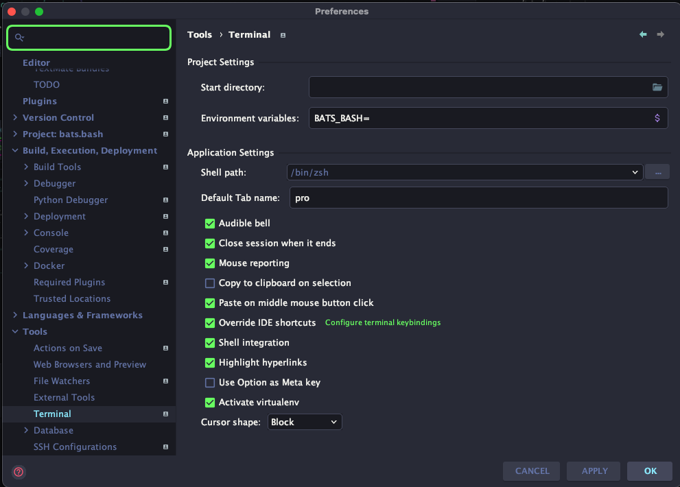
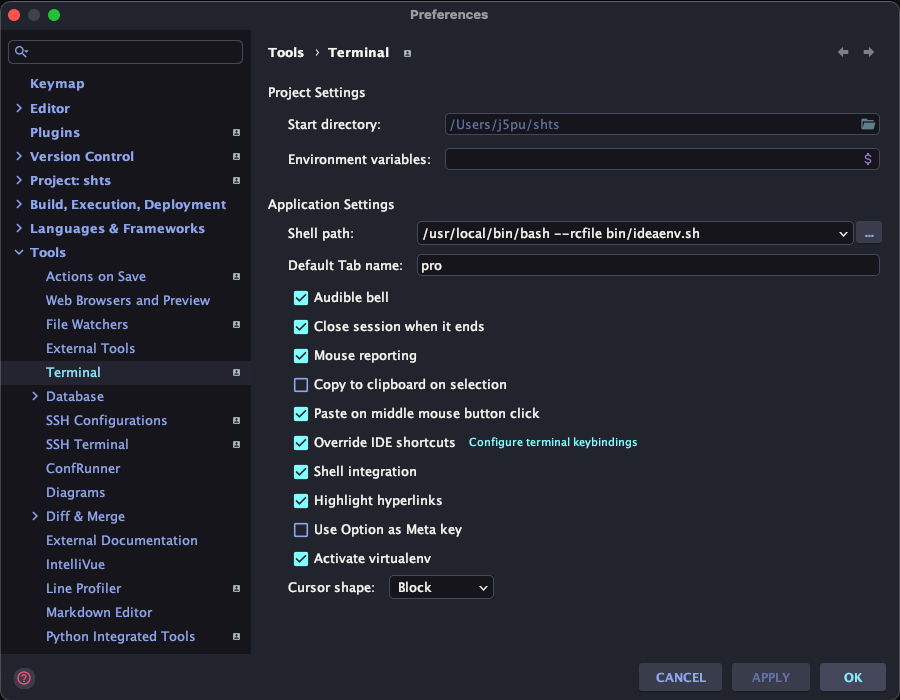

# [bats.bash](https://github.com/j5pu/bats.bash)


[](https://github.com/j5pu/bats.bash/actions/workflows/main.yaml)

[](https://github.com/j5pu/homebrew-tap/actions)

[Bats Helpers](./bin/shts.sh)


## Install

````shell
brew install j5pu/tap/shrc
bats.bash --help
````

## JetBrains




## [.env](.env)

```shell
# shellcheck disable=SC2034

PROJECT_DIR=$PROJECT_DIR$
BATS_NUMBER_OF_PARALLEL_JOBS=600
PATH="${PROJECT_DIR}/bin:${PATH}"
```

## [.envrc](.env)

### Alt 1: not needed
It is not needed if added to terminal:



### Alt 2: [.envrc with . ideaenv.sh](.env)
```shell
. ideaenv.sh
export FOO=2
```

### Alt 3: [.envrc filtering more JetBrains variables](.env)
````shell
PROJECT_DIR="$( cd "$(dirname "${BASH_SOURCE:-$0}")"; pwd -P )"; export PROJECT_DIR
eval "$(awk 'FNR > 3 { print "export " $0 }' "${PROJECT_DIR}/.env" | grep -v "^$" | sed 's/^/export /g')"

````
### Usage

`bats` is symlinked to `shts`. `bats` or `shts` can be used as interpreter on the shebang line.
#### [shebang](./tests/fixtures/shebang/true.shts)

````shell
#!/usr/bin/env shts
#shellcheck shell=bats

@test "$(shts::basename) " { shts::run; assert_success; }
````

#### [setup_file](./bin/shts.sh)

````shell
#!/usr/bin/env bats

setup_file() { source shts.sh; }

@test "${SHTS_TEST_BASENAME} " { shts::run; assert_success; }
````

#### [helper](tests/helpers/helper.bash)

##### [tests_helper.bats](tests/helpers/helper.bash)

```shell
# shellcheck shell=bash
source shts.sh
```

##### [test.bats](tests/shts.sh/func_exported.bats)

````shell
#!/usr/bin/env bats

setup_file() { load helpers/tests_helper; }

@test "${SHTS_TEST_BASENAME} " { shts::run; assert_success; }
````
